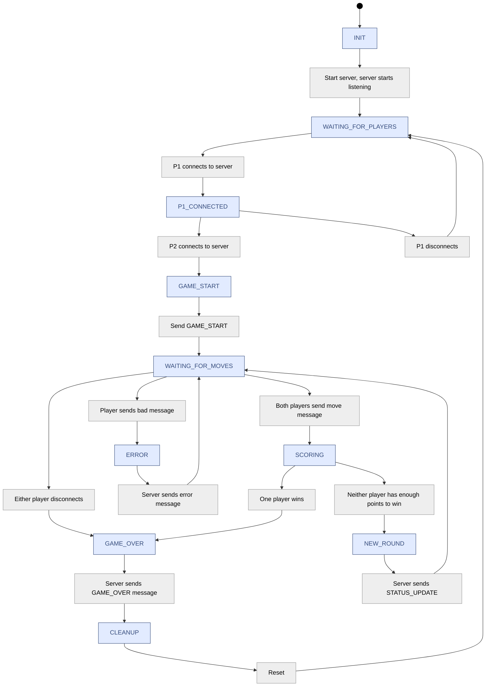

# Game Server State Machine

```mermaid
flowchart TB
    n1((" ")) --> n2["INIT"]
    n2 --> n3["Start server, server starts listening"]
    n3 --> n4["WAITING_FOR_PLAYERS"]
    n4 --> n5["P1 connects to server"]
    n5 --> n6["P1_CONNECTED"]
    n6 --> n7["P2 connects to server"] & n8["P1 disconnects"]
    n8 --> n4
    n7 --> n9["GAME_START"]
    n9 --> n10["Send GAME_START"]
    n10 --> n11["WAITING_FOR_MOVES"]
    n11 --> n12["Either player disconnects"] & n17["Player sends bad message"] & n20["Both players send move message"]
    n12 --> n13["GAME_OVER"]
    n13 --> n14["Server sends GAME_OVER message"]
    n14 --> n15["CLEANUP"]
    n15 --> n16["Reset"]
    n16 --> n4
    n17 --> n18["ERROR"]
    n18 --> n19["Server sends error message"]
    n19 --> n11
    n20 --> n21["SCORING"]
    n21 --> n22["Neither player has enough points to win"] & n25["One player wins"]
    n22 --> n23["NEW_ROUND"]
    n23 --> n24["Server sends STATUS_UPDATE"]
    n24 --> n11
    n25 --> n13

    class n1 Start
    class n2,n4,n6,n9,n11,n13,n15,n18,n21,n23 Sky
    class n3,n5,n7,n8,n10,n12,n14,n16,n17,n19,n20,n22,n24,n25 Ash

    classDef Start fill:#000000, stroke:#000000
    classDef Sky stroke-width:1px, stroke-dasharray:none, stroke:#374D7C, fill:#E2EBFF, color:#374D7C
    classDef Ash stroke-width:1px, stroke-dasharray:none, stroke:#999999, fill:#EEEEEE, color:#000000
```
