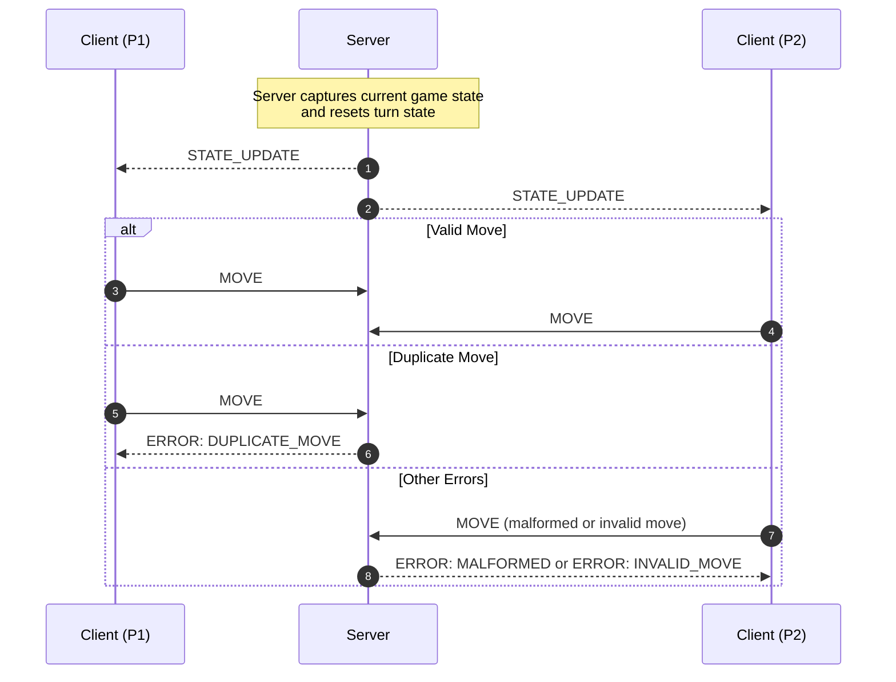

# Sequence Diagram

```mermaid
sequenceDiagram
    autonumber
    participant P1 as Client (P1)
    participant S as Server
    participant P2 as Client (P2)

    Note over S: Server captures current game state<br/>and resets turn state
    S-->>P1: STATE_UPDATE
    S-->>P2: STATE_UPDATE

    alt Valid Move
        P1->>S: MOVE
        P2->>S: MOVE
    else Duplicate Move
        P1->>S: MOVE
        S-->>P1: ERROR: DUPLICATE_MOVE
    else Other Errors
        P2->>S: MOVE (malformed or invalid move)
        S-->>P2: ERROR: MALFORMED or ERROR: INVALID_MOVE
    end
```
